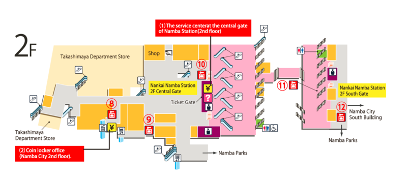
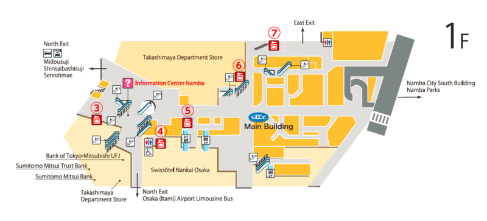
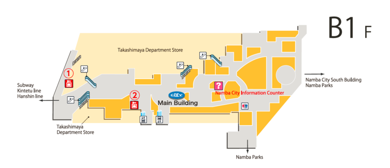
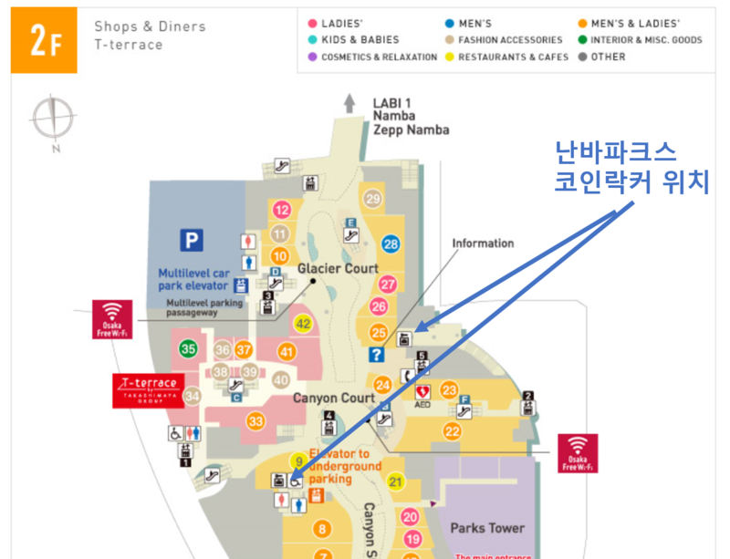
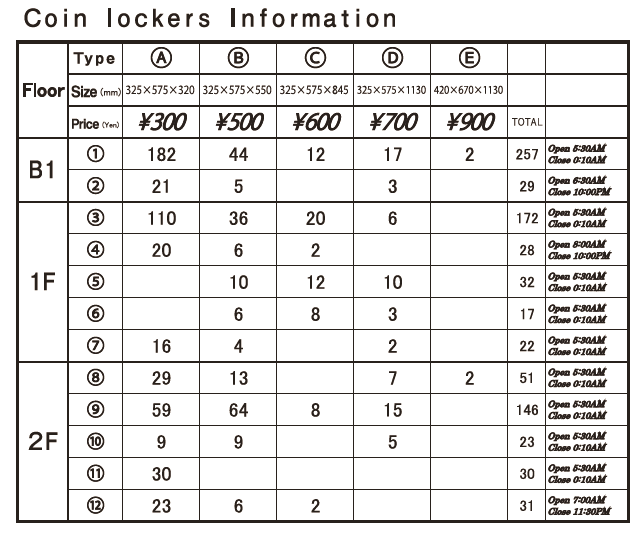
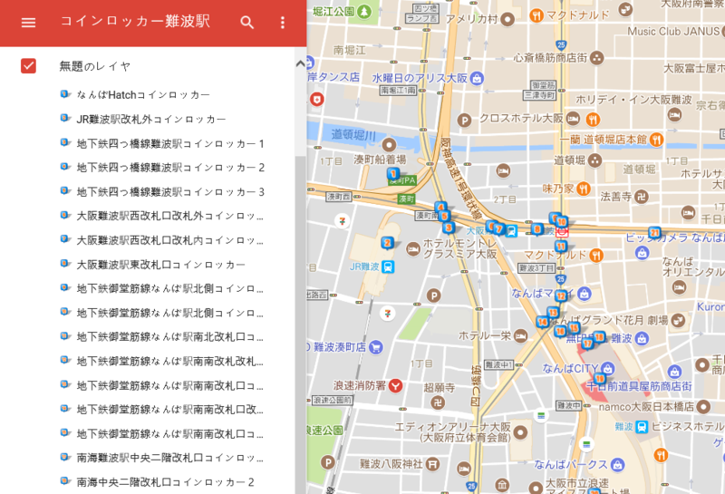

# 난바역 외부, HG 예약사무소
* HG 숙소 이용객 상관없이 이용가능
* 등에 맬수 있으면 300
* 케리어 500
* 큰건 700

# 난바역 안
## nest 
* 난카이 난바역 2층, 개찰구 나오자 마자 바로
* 500엔 오후8시까지
* 큰건 700
* 티웨이 티켓 상관없이 아무나 이용가능

## 코인라커
### 3층
* 간사이 공항가는 열차 타는 곳

### 2층
* 기차표 구입하는 매표소까지 쭉 직진하면
* 매표소 앞 작은 규모

### 1층
* 난카이난바역 1층 에스컬레이터 타고 출구쪽 직진하면 
* 토비야 빵집, 편의점이 오른편으로 보임
* 맞은편 코인라커
지하1층
* 옆 계단으로 1층 내려가면
* 난바역 연결된 지하도에 훨씬 더 많음

## 참고
* [라커검색](http://coinlockersearch.com/nanba.html)
* [구글맵](https://www.google.com/maps/d/u/0/viewer?mid=11iwEvUVMzE6yENsXBfKATIP5DIo&hl=ja&ll=34.664673377230464%2C135.5015563364866&z=18)
* [블로그](https://m.blog.naver.com/adnian/221059056514)

* コインロッカー難波駅 (코인난바역)
* 코인라카는 어디 있습니까?
  * コインラカはどこですか？

---

[**다시 홈으로**](./README.md)