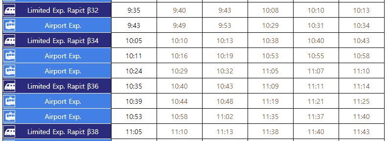
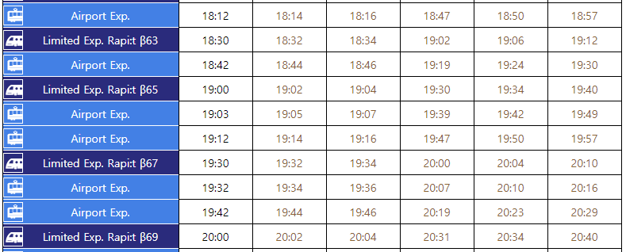

# 교통

* [세부 정보 구글맵에 저장](https://www.google.com/maps/d/u/0/edit?hl=en&mid=19e2sLZ_bSgVcwddDDardQFDvEslABaUa&ll=34.667111006978075%2C135.45934427691873&z=17)
* https://kepper.tistory.com/408

## 공항으로 오가는
* [티켓구입방법](https://www.howto-osaka.com/kr/traffic/train/purchase.html)
* [공항에서 오가는 시간표 정보](https://www.howto-osaka.com/kr/traffic/train/timetable.html)
* [난바역 안내](https://www.howto-osaka.com/kr/traffic/station/namba.html)
* 난카이 난바 역 1층에 관광 안내소

### KIX공항에서 난바역
* 주말(토요일, 일요일)

### 난바역에서 KIX공항
* 평일(화요일, 수요일)

### 아빠 

[난바역에서 바로 숙소로](https://www.google.com/maps/dir/Nankai+Namba+Station,+5+Chome-10+Nanba,+Chuo+Ward,+Osaka,+Japan/%E6%96%B0%E5%90%8D%E7%A7%B0%EF%BC%9APrendre+Nanba%EF%BC%88%E3%83%97%E3%83%A9%E3%83%B3%E3%83%89%E3%83%BC%E3%83%AB%E9%9B%A3%E6%B3%A2%EF%BC%89/@34.6616192,135.5015608,17.38z/data=!4m19!4m18!1m10!1m1!1s0x6000e76b8b59d3a5:0x7c1d92d9caaac227!2m2!1d135.5022953!2d34.6629331!3m4!1m2!1d135.5032149!2d34.6622954!3s0x6000e7696f7a33bb:0x76a1f4ce59f57c5e!1m5!1m1!1s0x6000e75d53015555:0xdaecbe08f23a7acc!2m2!1d135.5067625!2d34.6599231!3e2)

---

[**다시 홈으로**](./README.md)